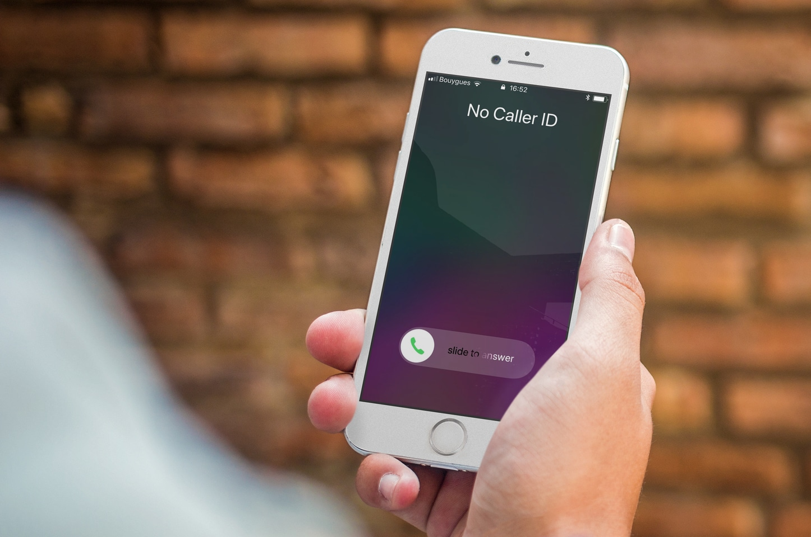

# Caller ID API

## Logistics
1. Run the app using `lein run`
   a) You may configure the port on which it is run by editing the `config.edn` file that you will find in the `config/` folder at the root level of this directory. This change does not need to be committed to the repository. Rather it can exist locally.
2. Start postman and run the following gets/posts.
   https://www.getpostman.com/collections/923a373c35a77db6ea5a
